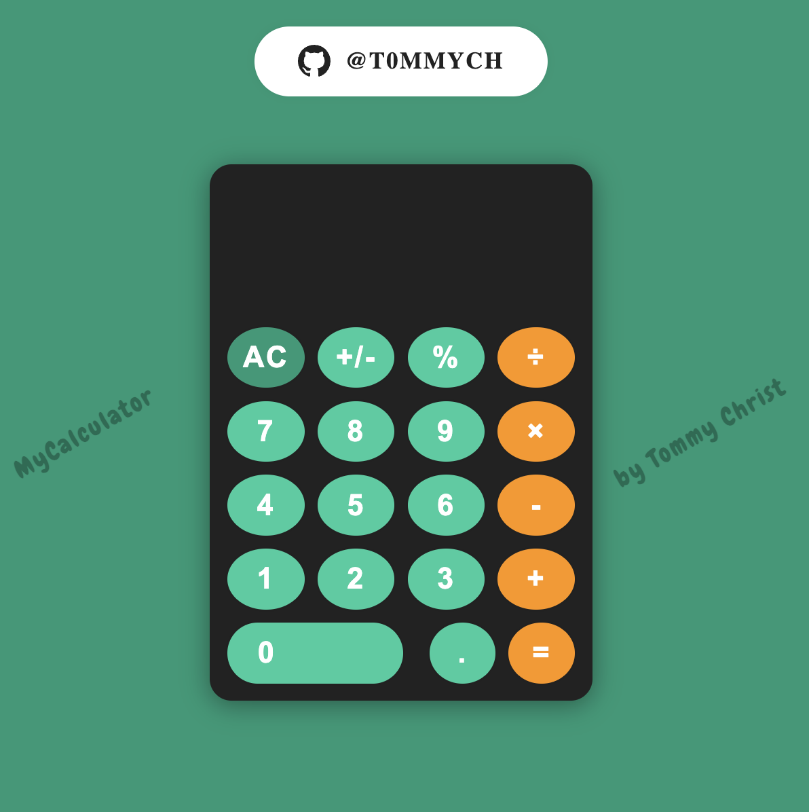

# MyCalculator

A beautiful, modern calculator app inspired by the iPhone calculator, built with React and JavaScript.

## Features
- iPhone-style calculator UI
- Responsive and animated buttons
- Real-time expression display
- Keyboard support for all calculator functions
- Custom color palette
- Watermark branding
- GitHub profile link

## Demo
You can run the app locally by following the instructions below.

## Installation
1. **Clone the repository:**
   
   git clone <your-repo-url>
   cd MyCalculator
   
2. **Install dependencies:**
   npm install
   
3. **Start the development server:**
   npm run dev
   
4. **Open your browser:**
   Visit [http://localhost:5173] or the port shown in your terminal.

## Usage
- Click the buttons or use your keyboard to perform calculations.
- The calculator supports basic arithmetic, percent, sign change, and real-time expression display.
- Click the GitHub button at the top to visit my profile.

## Keyboard Shortcuts
- Numbers: `0-9`
- Operators: `+`, `-`, `*`, `/`
- Equals: `Enter` or `=`
- Clear: `Escape` or `AC`
- Sign: `F9` or `+/-`
- Percent: `%`
- Decimal: `.`

## Credits
- UI inspired by iPhone calculator
- Button motion from [Uiverse.io by barisdogansutcu](https://uiverse.io/barisdogansutcu)
- GitHub button style inspired by Uiverse.io
- Font: [Chewy](https://fonts.google.com/specimen/Chewy)
- Developed by [@t0mmych](https://github.com/t0mmych)

## License

This project is open source and available to everyone
